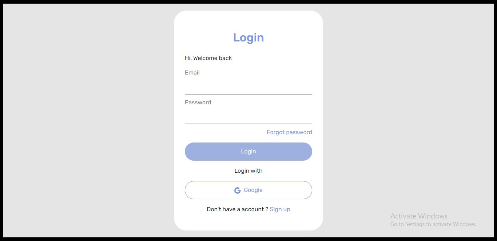
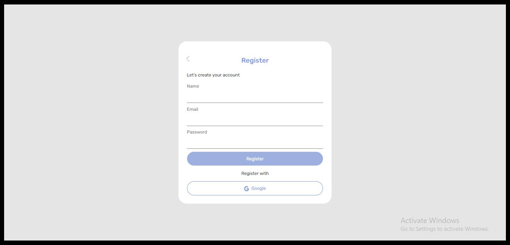
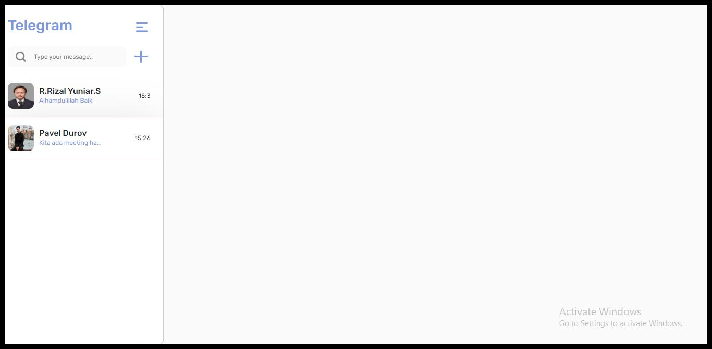
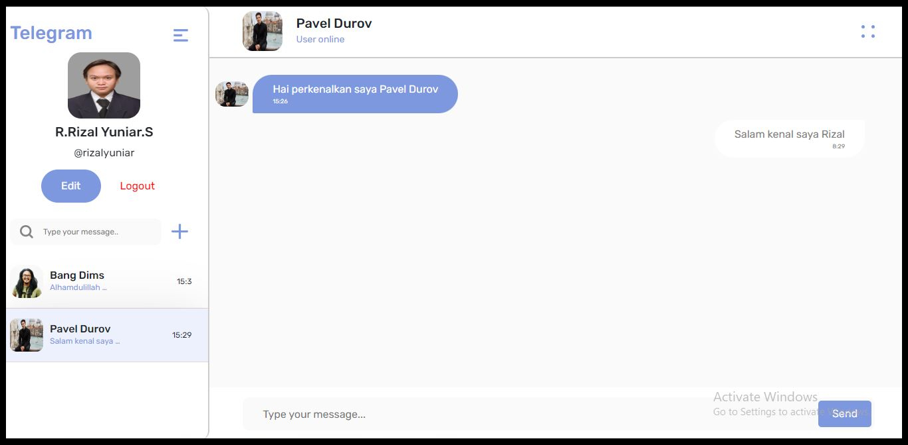
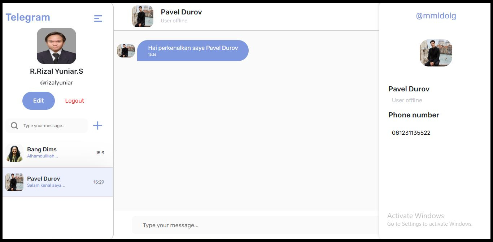
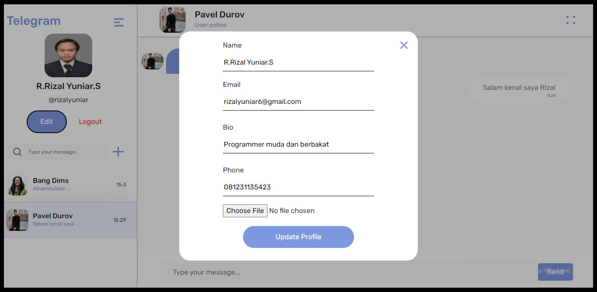

<br />
<p align="center">
<div align="center">
  
</div>
  <h3 align="center">Realtime App</h3>
  <p align="center">
    <a href="https://github.com/rrizalyuniar/RealtimeApp-FE"><strong>Explore the docs »</strong></a>
    <br />
    <a href="https://realtime-app-fe.vercel.app/">View Demo</a>
    ·
    <a href="/">Report Bug</a>
    ·
    <a href="/">Request Feature</a>
  </p>
</p>


<!-- TABLE OF CONTENTS -->
## Table of Contents

- [Table of Contents](#table-of-contents)
- [About The Project](#about-the-project)
  - [Built With](#built-with)
  - [Requirements](#requirements)
- [Getting Started](#getting-started)
  - [Prerequisites](#prerequisites)
  - [Installation](#installation)
  - [Setup .env](#setup-env)
- [Screenshots](#screenshots)
- [Contributing](#contributing)
- [Related Project](#related-project)
- [Contact](#contact)


<!-- ABOUT THE PROJECT -->
## About The Project

RealtimeApp is a chat application that shares messages instantly and real-time. Users can register an account first and log in to the account that has been registered to use this application. User can also edit profiles such as changing profile photos, user names, biodata, and phone numbers. This application was built using Socket.IO, React Js on the frontend and Express Js on the backend.

### Built With

[](https://react.dev/)
[](https://expressjs.com/)
[](https://www.postgresql.org/)
[](https://getbootstrap.com/)
- [Socket.IO](https://socket.io/)
- and other

### Requirements

[](/)

<!-- GETTING STARTED -->
## Getting Started

### Prerequisites

This is an example of how to list things you need to use the software and how to install them.

* [nodejs](https://nodejs.org/en/download/)

### Installation

- Clone This Front End Repo
```
git clone https://github.com/rrizalyuniar/RealtimeApp-BE.git
```
- Go To Folder Repo
```
cd RealtimeApp-BE
```
- Install Module
```
npm install
```
- <a href="#setup-env">Setup .env</a>
- Type ` npm run start` To Start Website
- Type ` npm run production` To Start Production

### Setup .env
Create .env file in your root project folder.
```
REACT_BACKEND_API_URL = [BACKEND_URL]
```

<!-- ROADMAP -->
## Screenshots Pages

<table>
 <tr>
    <td></td>
    <td></td>
  </tr>
   <tr>
    <td>Login</td>
    <td>register</td>
  </tr>
   <tr>
    <td></td>
    <td> </td>
  </tr>
   <tr>
    <td>Landing Page</td>
    <td>chat Page</td>
  </tr>

  <tr>
    <td> </td>
    <td></td>
  </tr>
   <tr>
    <td>Profile</td>
    <td>Edit Profile</td>
  </tr>
</table>


<!-- CONTRIBUTING -->
## Contributing

Contributions are what make the open source community such an amazing place to be learn, inspire, and create. Any contributions you make are **greatly appreciated**.

1. Fork the Project
2. Create your Feature Branch (`git checkout -b feature/AmazingFeature`)
3. Commit your Changes (`git commit -m 'Add some AmazingFeature'`)
4. Push to the Branch (`git push origin feature/AmazingFeature`)
5. Open a Pull Request


## Related Project
:rocket: [`Backend RealtimeApp`](https://github.com/rrizalyuniar/RealtimeApp-BE)

:rocket: [`Frontend RealtimeApp`](https://github.com/rrizalyuniar/RealtimeApp-FE)

:rocket: [`Demo RealtimeApp`](https://realtime-app-fe.vercel.app/)

<!-- CONTACT -->
## Contact

My Email : rizalyuniar123@gmail.com

Project Link: [https://github.com/rrizalyuniar/RealtimeApp-FE/](https://github.com/rrizalyuniar/RealtimeApp-FE/)